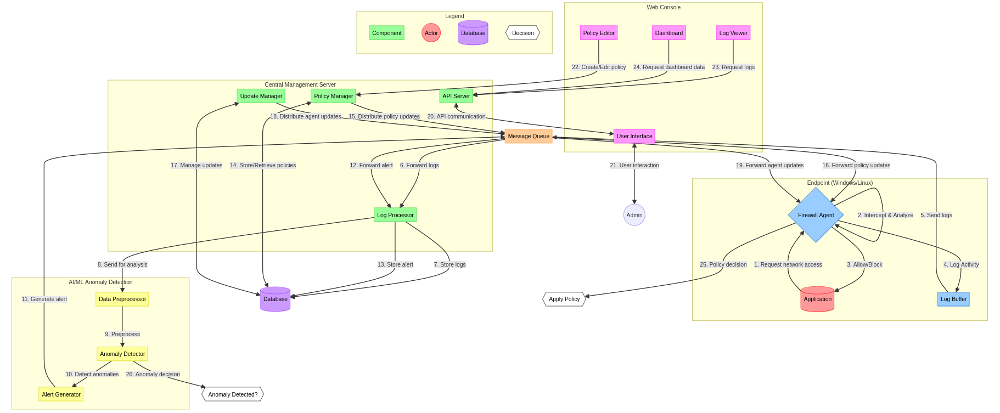

# Firewall

## Architecture:

[HLD in detail explanation](./HLD.md)

## Components:

| Component                     | Language            |
| ----------------------------- | ------------------- |
| Application Firewall Agent    | (Rust)              |
| Central Management Server     | (Go)                |
| Web Console                   | (Python with Flask) |
| AI/ML-based Anomaly Detection | (Python)            |

## Implementation:

### 1. Firewall Agent (Per Application):
* It will be responsible for identifying `domains`, `protocols`, and `IP addresses` that applications are trying to access 
* Enforcing firewall policies
* `Rust` is an excellent choice for this component due to its `performance` and `safety features`
* Key features:
  * Identify network connections per application
  * Apply firewall rules
  * Collect network usage logs
  * Send logs to the central server
* Basic [Firewall Agent Here](./src/agent/)

### 2. Central Management Server:
* Will manage firewall policies
* Receive logs from agents, and provide an API for the web console. 
* `Go` is well-suited for building efficient and scalable servers.
* Key features:
  * Manage firewall policies
  * Receive and store logs from agents
  * Provide API for web console
  * Handle agent registration and authentication
* Basic [Central Server Here](./src/server/)

### 3. Web Console:
* It will provide a user interface for managing firewall policies and viewing logs. 
* `Python` with `Flask` is a good choice for rapid development of web applications.
* Key features:
  * Display and manage firewall policies
  * View logs and alerts
  * User authentication and authorization
* Basic [Web Console Here](./src/console/)

### 4. AI/ML-based Anomaly Detection:
* For the anomaly detection component, we can use Python with libraries like `scikit-learn` or `TensorFlow`.
* Key features:
  * Process network usage logs
  * Train models to detect anomalies
  * Generate alerts for abnormal behavior
* Basic [Anamoly Detection basic str Here](./src/detection/)

### 5. Future (Linux Support):

Extend the solution to work on Linux using iptables or nftables for firewall policy enforcement.